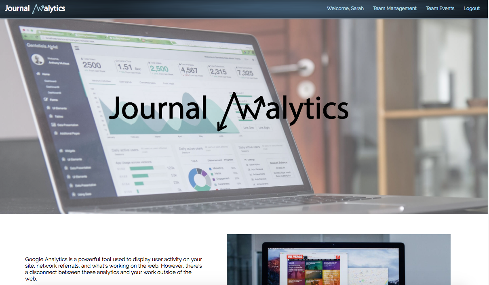
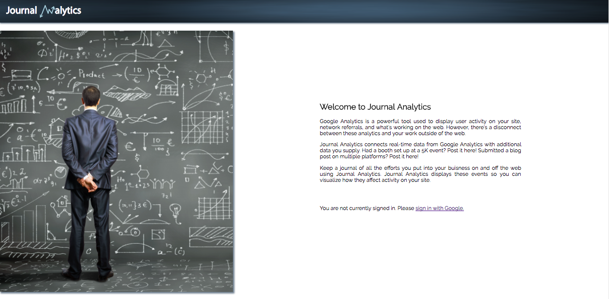
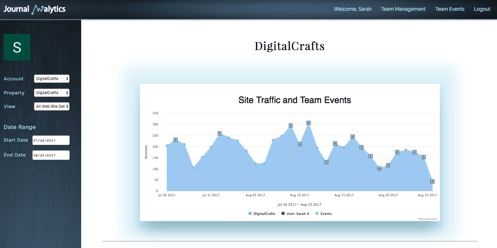
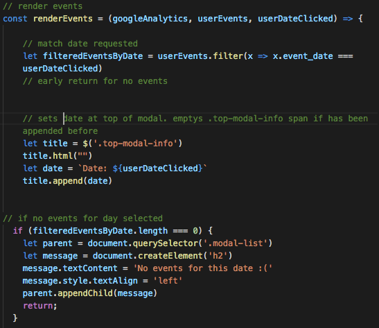
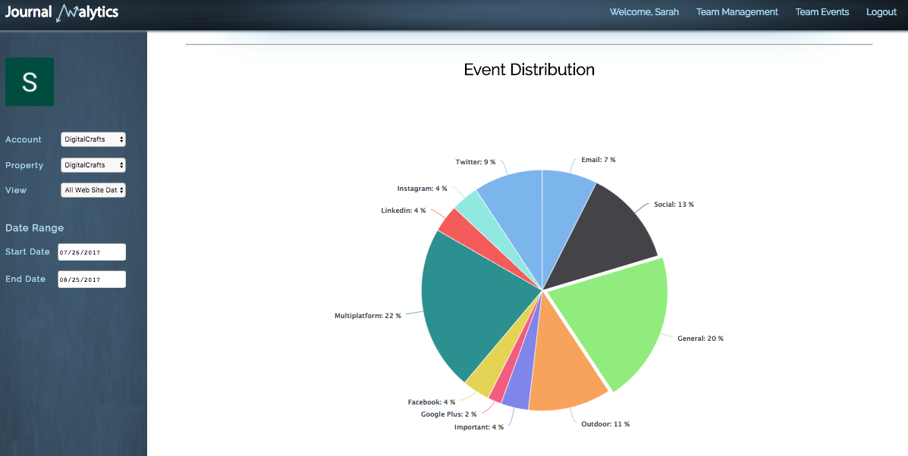
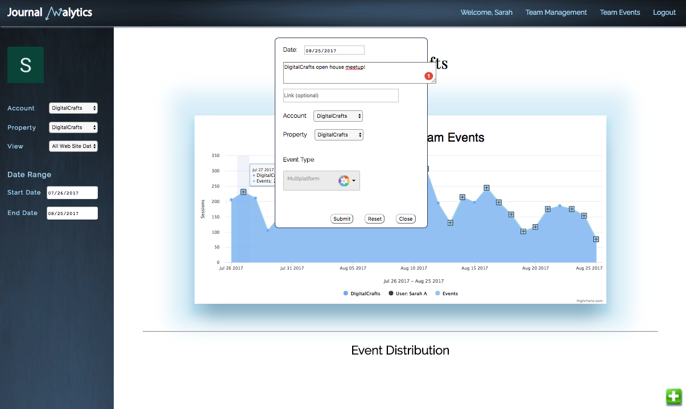
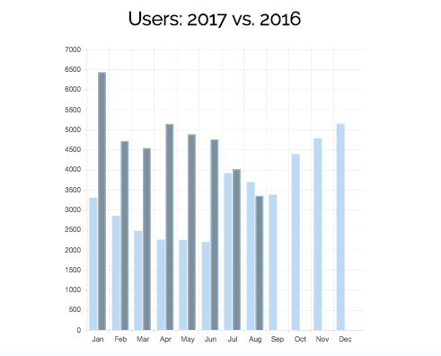
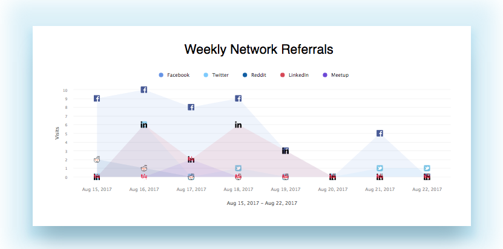
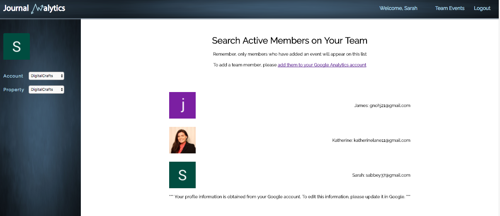
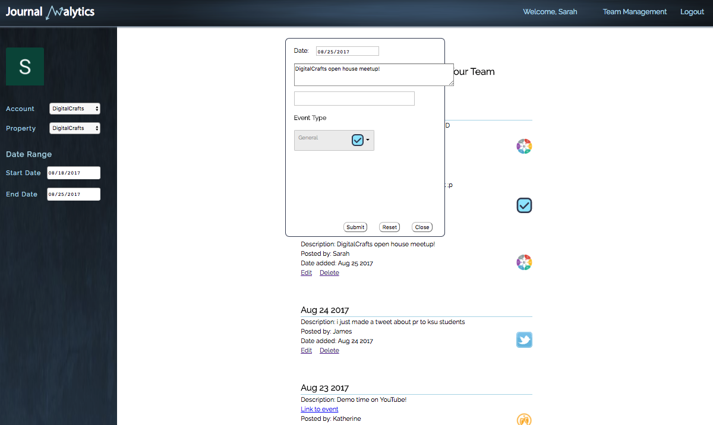

# Journal Analytics


<h2>What is Journal Analytics?</h2>

<p>Journal Analytics allows users to connect site activity data obtained from their Google Analytics accounts with events posted by their team. Had a booth set up at a 5K event? Post it here! Submitted a blog post on multiple platforms? Post it here! Keep a journal of all the efforts you put into your buisness on and off the web using Journal Analytics. Journal Analytics displays these events so you can visualize how they affect activity on your site.</p>

<h2><u>The Team:</u></h2>

<h3>James Hong: https://github.com/gnohj</h3>
<b>Primary team role:</b> Chart master
</br>
<b>Contributions:</b> Utilized Google Analytics API, HighCharts, and ChartJS to render graphs. Assisted in creating server, routes, and API.

<h3>Katie Lane: https://github.com/MaeDae11</h3>
<b>Primary team role:</b> Styling wizard
</br>
<b>Contributions:</b> Main focus was HTML, CSS, JavaScript, UI/UX, and jQuery for entire site. Created the Journal Analytics logo, site design, and branding. Tested responsive design and implemented changes with team as needed. Ensured consistent design throughout site. Assisted in creating server, routes, and API.

<h3>Sarah Abbey: https://github.com/sabbey37</h3>
<b>Primary team role:</b> Database magician
</br>
<b>Contributions:</b> Implemented Google OAuth using Passport.js. Assisted in creating server, routes, and API. Wrote PostgreSQL database queries to create, retrieve, update, and delete information. Created EC2 instance to host site and database. Assisted all team members in connecting to database via Postico so all members could view the same information and edit the database schema as needed. Wrote JavaScript for 'Team Management' and 'Team Events' pages.

</br>
</br>

# Documented Progress
      
      

# Challenges & Solutions
<h3>Some of the biggest challenges we faced with this project build included:</h2>

<b>Challenge:</b> Google Analytics API did not allow for server-side rendering of graphs using JavaScript.
</br>
<b>Solution:</b> Obtained raw data from graph after render. Used raw data with ChartJS and HighCharts libraries to render graphs and have more control over graph appearance.

<b>Challenge:</b> Combining server-side rendering with user interface.
</br>
<b>Solution:</b> Used Express and Handlebars to render different page views. Used JavaScript and jQuery to update specific page elements after page is rendered.


</br>
# Stretch Goals


# Tools
<ul>
<li> JavaScript </li>
<li> Node.js </li>
<li> Express </li>
<li> Handlebars </li>
<li>Google Analytics API</li>
</ul>

<h4> JavaScript Libraries </h4>
<ul>
  <li> JQuery </li>
  <li> HighCharts </li>
  <li> ChartJS </li>
  <li> MomentJS </li>
  <li> DDSlickJS </li>
  <li> Passport.js </li>
</ul>

<h4> Testing </h4>
<ul>
 <li> Mocha </li>
 <li> Chai </li>
</ul>


# Live Demo
https://www.youtube.com/watch?v=-r-Tvb5xrN8

<h2><u>Code Snippets:</u></h2>

<h4>This code obtains a user's profile information from Google after authentication. The query updates a row if it already exists or inserts a new row if the row does not exist already.</h4>

``` javascript

passport.use(new GoogleStrategy({
    clientID: process.env.GOOGLE_CLIENT_ID,
    clientSecret: process.env.GOOGLE_CLIENT_SECRET,
    callbackURL: process.env.GOOGLE_CALLBACK
  },
    function(accessToken, refreshToken, profile, done) {
        var firstname = profile.name.givenName;
        firstname = firstname.replace("'", "''");
        var surname = profile.name.familyName;
        surname = surname.replace("'", "''");
        db.one(`
        insert into users (email, firstname, surname)
        values ('${profile.emails[0].value}', '${firstname}', '${surname}')
        on conflict (email)
        do update set (firstname, surname) = ('${firstname}', '${surname}')
        where users.email = '${profile.emails[0].value}';
        select * from users where email = '${profile.emails[0].value}';
      `)
            .then((result) => {
                done(null, profile.emails[0].value);
            })
}));
```
<br/>


<h4>This snippet shows how user events are filtered by the date the user clicks on the graph and added to the modal.</h4>

``` javascript

const renderEvents = (googleAnalytics, userEvents, userDateClicked) => {

  // match date requested
  let filteredEventsByDate = userEvents.filter(x => x.event_date === userDateClicked)
  // early return for no events

  // sets date at top of modal. emptys .top-modal-info span if has been appended before
  let title = $('.top-modal-info')
  title.html("")
  let date = `Date: ${userDateClicked}`
  title.append(date)
    
  // if no events for day selected
  if (filteredEventsByDate.length === 0) {
    let parent = document.querySelector('.modal-list')
    let message = document.createElement('h2')
    message.textContent = 'No events for this date :('
    message.style.textAlign = 'left'
    parent.appendChild(message)
    return;
  };
};
```

<br/>

<h2><u>Screenshots:</u></h2>

<h4>Landing page</h4>
<br/>


<h4>Login page</h4>
<br/>


<h4>Main graph showing total sessions on site. A plus icon appears if your team has added an event on this day.</h4>
<br/>


<h4>This events modal pops up when a user clicks on the graph on a particular day. It shows the events posted for that day.</h4>
<br/>


<h4>Pie graph showing distribution of events your team has added by method (ex. Facebook, Twitter, etc). </h4>
<br/>


<h4>Users can add events for their team.</h4>
<br/>


<h4>Bar chart highlighting total sessions over the past 2 years.</h4>
<br/>


<h4>Weekly network referrals</h4>
<br/>


<h4>User can see all active members on their teams</h4>
<br/>


<h4>User can edit or delete their team's events on the "Team Events" page</h4>
<br/>

